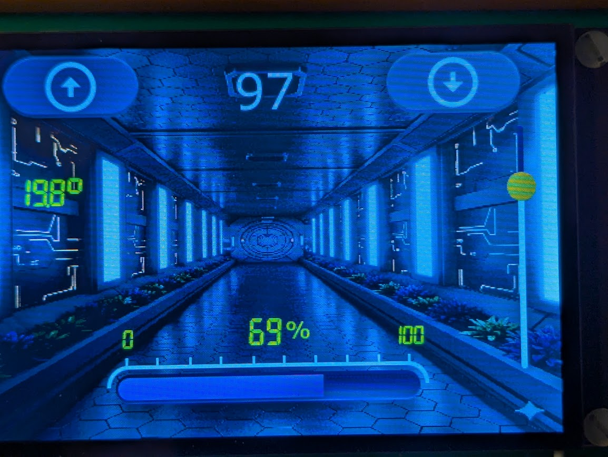

# nucleof446_tgfx_st7796_cap

NucleoF446RE with ST7796, FT6336 capacitive touch and TouchGFX

Counter with up down buttons and a san image progress bar.
Read and display a DHT11 / AM2302 Temperature and Humidity Sensor.
Use SevenSegment Display font. Use W25Q128 to store images and fonts.

